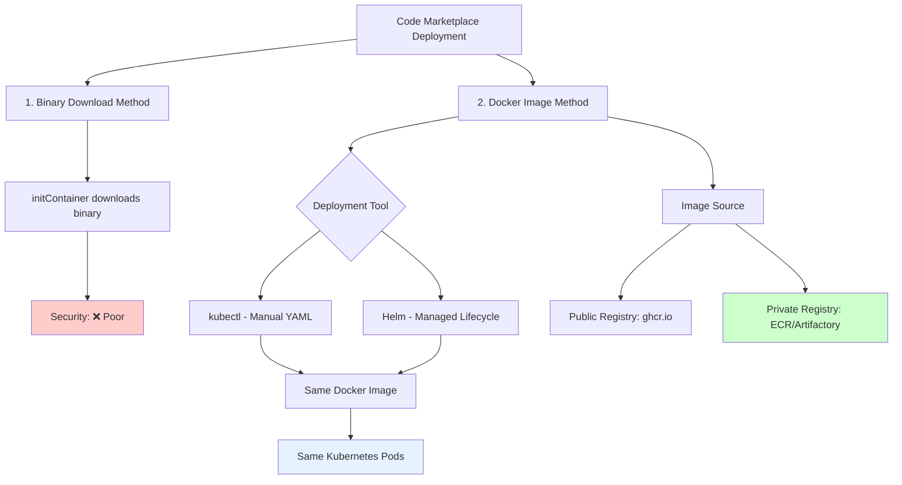
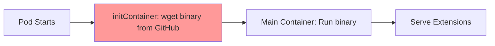
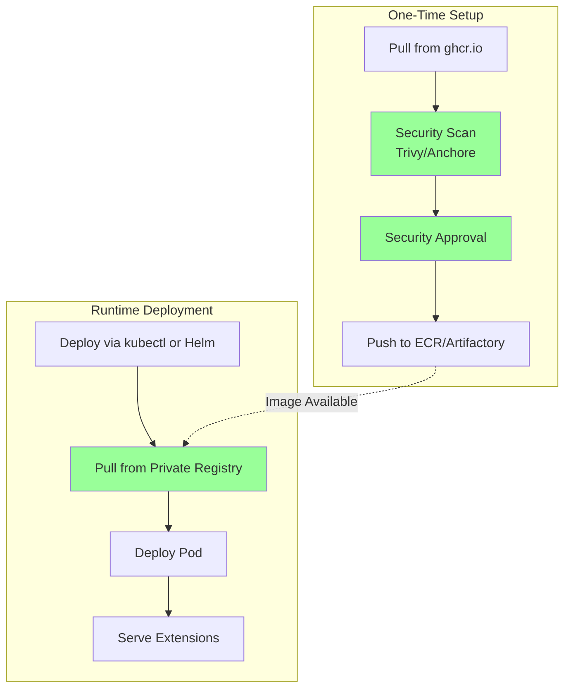
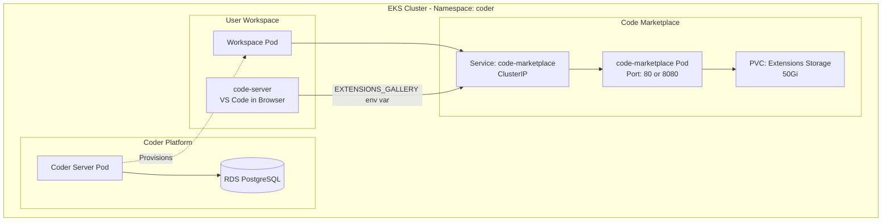
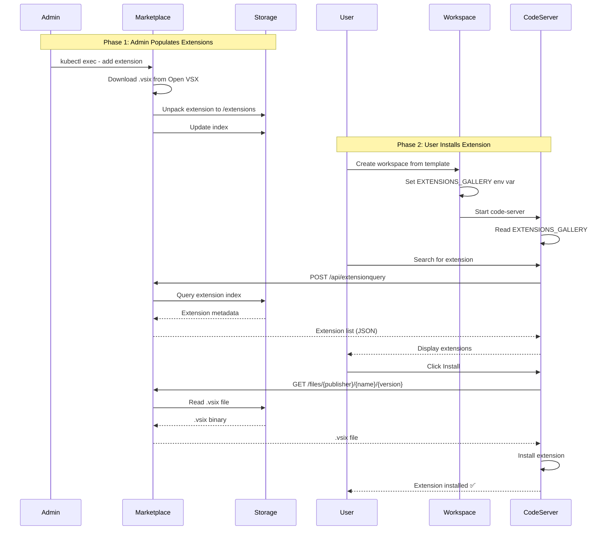

# ADR: Code Marketplace Deployment Strategy

## Deployment Approaches Overview

There are **two fundamental approaches** for deploying code-marketplace:

1. **Binary Download Method**: Download binary at runtime via initContainer
2. **Docker Image Method**: Use pre-built Docker image

For Docker Image method, there are **two deployment tools**:
- **kubectl**: Manual YAML management
- **Helm**: Managed deployment with lifecycle features



---

## Option 1: Runtime Binary Download (initContainer)

Download the code-marketplace binary from GitHub at pod startup.



**Implementation**:
```yaml
initContainers:
- name: download-binary
  image: alpine:latest
  command:
    - wget https://github.com/coder/code-marketplace/releases/download/v2.4.0/code-marketplace-linux-amd64
    - chmod +x /tmp/code-marketplace

containers:
- name: code-marketplace
  image: alpine:latest
  command: [/tmp/code-marketplace, server, --extensions-dir=/extensions]
```

**Pros**:
- Simple implementation
- No Docker image registry needed
- Minimal setup

**Cons**:
- Runtime download from public internet
- No image scanning/vulnerability assessment
- Binary not verified or approved
- Network dependency at pod startup
- Re-downloads on every pod restart
- Fails if GitHub is unreachable

**Security Considerations**:
- ❌ No supply chain verification
- ❌ No security scanning
- ❌ Runtime internet access required
- ❌ No approval workflow
- ❌ Binary could be compromised during download
- ❌ No version pinning guarantees

**Compliance**: ❌ **FAILS** - Violates most enterprise security policies

---

## Option 2: Docker Image Method

Use the official Docker image that contains the pre-compiled binary.

**Image**: `ghcr.io/coder/code-marketplace:v2.4.0`

### Option 2A: Deploy with kubectl (Manual YAML)

Manually write Kubernetes YAML files and deploy with kubectl.


**Implementation**:
```yaml
# code-marketplace-deployment.yaml
apiVersion: apps/v1
kind: Deployment
metadata:
  name: code-marketplace
  namespace: coder
spec:
  template:
    spec:
      containers:
      - name: code-marketplace
        image: ghcr.io/coder/code-marketplace:v2.4.0
        args: [server, --extensions-dir=/extensions, --address=0.0.0.0:8080]
        volumeMounts:
        - name: extensions
          mountPath: /extensions
      volumes:
      - name: extensions
        persistentVolumeClaim:
          claimName: marketplace-extensions
---
apiVersion: v1
kind: Service
metadata:
  name: code-marketplace
  namespace: coder
spec:
  type: ClusterIP
  ports:
  - port: 8080
    targetPort: 8080
```

**Deploy**:
```bash
kubectl apply -f code-marketplace-deployment.yaml
```

**Pros**:
- Simple and direct
- Full control over YAML
- No additional tools needed
- Easy to understand

**Cons**:
- Manual version management
- No built-in rollback mechanism
- Configuration changes require YAML edits
- No deployment history tracking

### Option 2B: Deploy with Helm (Managed Lifecycle)

Use official Helm chart for managed deployment.


**Implementation**:
```bash
# Clone Helm chart repository
git clone --depth 1 https://github.com/coder/code-marketplace

# Deploy with Helm
helm upgrade --install code-marketplace ./code-marketplace/helm \
  --namespace coder \
  --set image.repository=ghcr.io/coder/code-marketplace \
  --set image.tag=v2.4.0 \
  --set persistence.size=50Gi
```

**Pros**:
- Official chart from vendor (maintained by Coder)
- Easy configuration via values.yaml or --set
- Built-in version management
- Simple rollback: `helm rollback code-marketplace`
- Deployment history tracking
- GitOps compatible

**Cons**:
- Requires cloning GitHub repo for Helm chart
- Additional complexity (Helm knowledge needed)
- Default port is 80 (not 8080)

**Note**: Helm chart uses **port 80** by default, not 8080. Update workspace templates accordingly.

---

## Recommended Production Approach

### Private Registry Mirror (kubectl or Helm)

Mirror the official image to your private registry for security and compliance.



**One-time setup**:
```bash
# Pull official image
docker pull ghcr.io/coder/code-marketplace:v2.4.0

# Scan with internal tools
trivy image ghcr.io/coder/code-marketplace:v2.4.0

# Tag for private registry
docker tag ghcr.io/coder/code-marketplace:v2.4.0 \
  123456789.dkr.ecr.us-east-1.amazonaws.com/code-marketplace:v2.4.0

# Push to private registry
docker push 123456789.dkr.ecr.us-east-1.amazonaws.com/code-marketplace:v2.4.0
```

**Deploy with kubectl**:
```yaml
containers:
- name: code-marketplace
  image: 123456789.dkr.ecr.us-east-1.amazonaws.com/code-marketplace:v2.4.0
```

**Deploy with Helm**:
```bash
helm upgrade --install code-marketplace ./code-marketplace/helm \
  --namespace coder \
  --set image.repository=123456789.dkr.ecr.us-east-1.amazonaws.com/code-marketplace \
  --set image.tag=v2.4.0
```

---

## How Code Marketplace Works

### Architecture Overview



### Extension Installation Flow



### Step-by-Step Process

#### 1. Deploy Code Marketplace

**Via kubectl**:
```bash
kubectl apply -f code-marketplace-deployment.yaml
```

**Via Helm**:
```bash
helm upgrade --install code-marketplace ./code-marketplace/helm --namespace coder
```

This creates:
- Pod running code-marketplace binary
- Service (ClusterIP) for internal access
- PVC for extension storage

#### 2. Populate Extensions

Admin adds extensions to the marketplace:

```bash
# Get marketplace pod name
MARKETPLACE_POD=$(kubectl get pods -n coder -l app.kubernetes.io/name=code-marketplace -o jsonpath='{.items[0].metadata.name}')

# Add extension from Open VSX
kubectl exec -n coder $MARKETPLACE_POD -- \
  /opt/code-marketplace add \
  "https://open-vsx.org/api/vscodevim/vim/1.27.2/file/vscodevim.vim-1.27.2.vsix" \
  --extensions-dir /extensions
```

**What happens**:
1. Downloads `.vsix` file from Open VSX (open-source extension registry)
2. Unpacks extension to `/extensions/{publisher}/{name}/{version}/`
3. Updates marketplace index for API queries

**Extension storage structure**:
```
/extensions/
├── vscodevim/
│   └── vim/
│       └── 1.27.2/
│           ├── extension/
│           │   ├── package.json
│           │   ├── README.md
│           │   └── ... (extension files)
│           └── vscodevim.vim-1.27.2.vsix
```

#### 3. Configure Coder Templates

Update workspace templates to use private marketplace by adding `EXTENSIONS_GALLERY` environment variable:

```hcl
resource "coder_agent" "main" {
  env = {
    # Important: Port must match marketplace service port
    # Helm chart uses port 80
    EXTENSIONS_GALLERY = jsonencode({
      serviceUrl          = "http://code-marketplace.coder.svc.cluster.local:80/api"
      itemUrl            = "http://code-marketplace.coder.svc.cluster.local:80/item"
      resourceUrlTemplate = "http://code-marketplace.coder.svc.cluster.local:80/files/{publisher}/{name}/{version}/{path}"
    })
  }
}
```

**Port Configuration**:
- **Helm chart default**: Port 80
- **Manual kubectl YAML**: Often uses port 8080 (customizable)
- **Critical**: Template must match the actual service port

**DNS Resolution**:
- Format: `{service-name}.{namespace}.svc.cluster.local`
- Example: `code-marketplace.coder.svc.cluster.local`
- Kubernetes CoreDNS resolves this automatically (no external DNS needed)

#### 4. Deploy Templates

```bash
cd template-promoter
terraform apply
```

This updates Coder templates to include the `EXTENSIONS_GALLERY` configuration.

#### 5. User Creates Workspace

1. User creates workspace from template via Coder UI
2. Workspace pod starts with `EXTENSIONS_GALLERY` environment variable
3. code-server reads the env var and redirects extension requests to private marketplace

#### 6. User Installs Extensions

**In code-server**:
1. User opens Extensions panel
2. Searches for extension (e.g., "vim")
3. code-server queries marketplace via `POST /api/extensionquery`
4. Marketplace returns list of available extensions
5. User clicks Install
6. code-server downloads `.vsix` from marketplace via `GET /files/{publisher}/{name}/{version}`
7. Extension installs in workspace

**Network flow**:
```
Workspace Pod → DNS Resolution → Service (code-marketplace) → Marketplace Pod → PVC Storage
```

All communication is **internal** (ClusterIP) - no external traffic.

---
