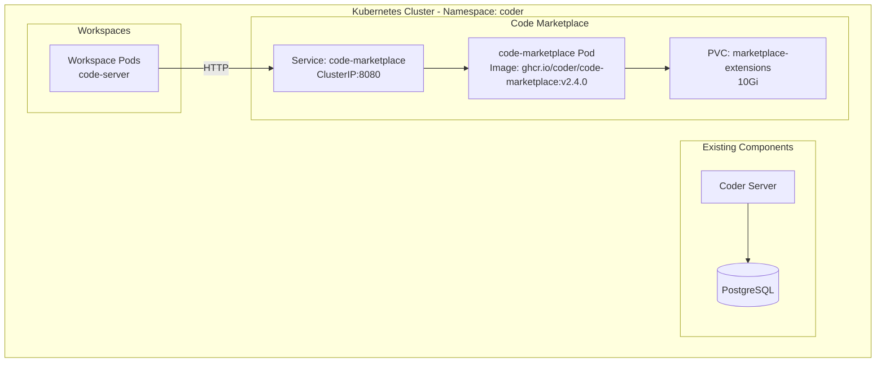
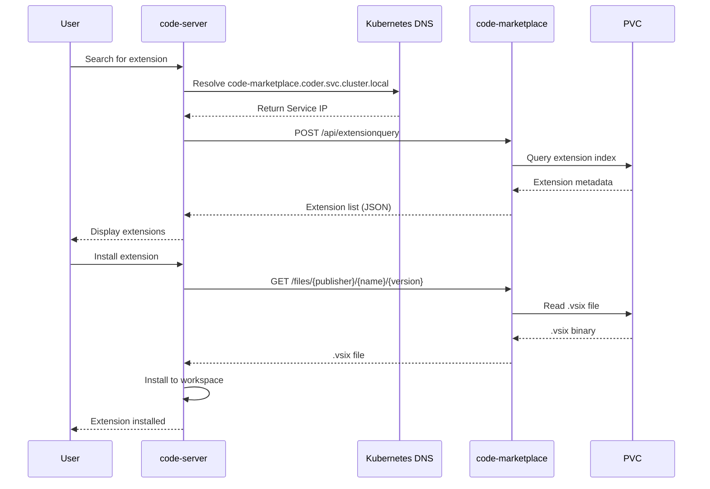

# Code Marketplace with Official Docker Image - Design Document

## Overview

This document describes the implementation of a private VS Code extension marketplace for Coder using the official Docker image instead of runtime binary downloads.

## Problem Statement

Initial implementation downloaded the `code-marketplace` binary from GitHub at pod startup (initContainer pattern). This approach has compliance issues:
- Runtime downloads from external sources
- No image scanning/approval process
- Security teams often block runtime downloads from public internet

## Solution

Use the official Docker image (`ghcr.io/coder/code-marketplace`) which contains the pre-compiled binary, eliminating runtime downloads.

## Architecture



## Component Details

### Docker Image

**Image**: `ghcr.io/coder/code-marketplace:v2.4.0`

**Contents**:
- Base: Alpine Linux
- Binary: `/opt/code-marketplace` (pre-compiled Go binary)
- No runtime downloads needed

**Image Location**: GitHub Container Registry (ghcr.io)

### Deployment Configuration

**File**: `code-marketplace-deployment-image.yaml`

```yaml
containers:
- name: code-marketplace
  image: ghcr.io/coder/code-marketplace:v2.4.0
  args:
    - server
    - --extensions-dir=/extensions
    - --address=0.0.0.0:8080
  volumeMounts:
  - name: extensions
    mountPath: /extensions
```

**Key differences from binary download approach**:
- No initContainer needed
- Binary already in image at `/opt/code-marketplace`
- Simpler deployment manifest
- Faster pod startup (no download step)

### Storage

**PersistentVolumeClaim**: `marketplace-extensions`
- Size: 10Gi
- Access Mode: ReadWriteOnce
- Storage Class: `standard` (KIND) or `gp3` (EKS)
- Mount Path: `/extensions`

**Extension Storage Format**:
```
/extensions/
├── {publisher}/
│   └── {name}/
│       └── {version}/
│           ├── extension/
│           │   ├── package.json
│           │   ├── README.md
│           │   └── ...
│           └── {publisher}.{name}-{version}.vsix
```

Example:
```
/extensions/
├── vscodevim/
│   └── vim/
│       └── 1.27.2/
│           ├── extension/
│           └── vscodevim.vim-1.27.2.vsix
```

### Service

**Type**: ClusterIP (internal only)
**DNS**: `code-marketplace.coder.svc.cluster.local`
**Port**: 8080
**Endpoints**:
- `GET /` - Health check
- `POST /api/extensionquery` - VS Code Extension Gallery API v3.0
- `GET /files/{publisher}/{name}/{version}/*` - Extension files

## Deployment Process

### 1. Deploy Marketplace

```bash
kubectl apply -f code-marketplace-deployment-image.yaml
```

Creates:
- PersistentVolumeClaim for extension storage
- Deployment with official Docker image
- ClusterIP Service for internal access

### 2. Populate Extensions

**Script**: `populate-marketplace-image.sh`

```bash
./populate-marketplace-image.sh
```

For each extension:
```bash
kubectl exec -n coder $MARKETPLACE_POD -- \
  /opt/code-marketplace add \
  "https://open-vsx.org/api/{publisher}/{name}/{version}/file/{publisher}.{name}-{version}.vsix" \
  --extensions-dir /extensions
```

The binary:
1. Downloads `.vsix` from Open VSX
2. Extracts extension metadata
3. Unpacks to `/extensions/{publisher}/{name}/{version}/`
4. Updates marketplace index

### 3. Configure Templates

Add environment variable to workspace template:

```hcl
resource "coder_agent" "main" {
  env = {
    EXTENSIONS_GALLERY = jsonencode({
      serviceUrl          = "http://code-marketplace.coder.svc.cluster.local:8080/api"
      itemUrl            = "http://code-marketplace.coder.svc.cluster.local:8080/item"
      resourceUrlTemplate = "http://code-marketplace.coder.svc.cluster.local:8080/files/{publisher}/{name}/{version}/{path}"
    })
  }
}
```

This redirects code-server from Microsoft's marketplace to the private marketplace.

### 4. Deploy Templates

```bash
cd template-promoter
terraform apply
```

## How It Works

### Extension Installation Flow



### DNS Resolution

Kubernetes provides built-in DNS (CoreDNS) that automatically resolves service names:

**Format**: `{service-name}.{namespace}.svc.cluster.local`

**Example**: `code-marketplace.coder.svc.cluster.local` resolves to Service ClusterIP

No external DNS configuration needed - automatic within cluster.

### API Format

The marketplace implements VS Code Extension Gallery API v3.0:

**Search/List Request**:
```bash
POST /api/extensionquery
Content-Type: application/json

{
  "filters": [{
    "criteria": [{
      "filterType": 8,
      "value": "Microsoft.VisualStudio.Code"
    }]
  }],
  "flags": 439
}
```

**Response**:
```json
{
  "results": [{
    "extensions": [{
      "extensionId": "vscodevim.vim",
      "extensionName": "vim",
      "displayName": "Vim",
      "publisher": {
        "publisherName": "vscodevim"
      },
      "versions": [{
        "version": "1.27.2",
        "files": [{
          "assetType": "Microsoft.VisualStudio.Services.VSIXPackage",
          "source": "http://code-marketplace.coder.svc.cluster.local:8080/files/vscodevim/vim/1.27.2/vscodevim.vim-1.27.2.vsix"
        }]
      }]
    }]
  }]
}
```

## Comparison: Binary Download vs Docker Image

| Aspect | Binary Download (Old) | Docker Image (New) |
|--------|----------------------|-------------------|
| **Deployment** | initContainer + main container | Single container |
| **Binary Location** | `/tmp/code-marketplace` | `/opt/code-marketplace` |
| **Runtime Downloads** | Yes (from GitHub) | No |
| **Pod Startup Time** | Slower (download + extract) | Faster |
| **Compliance** | May fail (runtime downloads) | Better (image can be scanned) |
| **Image Source** | N/A | ghcr.io (public) or private registry |
| **Complexity** | Higher (2 containers) | Lower (1 container) |
| **Restart Behavior** | Re-downloads binary | Uses existing image |

### Migration Path

**From Binary Download**:
```yaml
# OLD
initContainers:
- name: download-binary
  image: alpine:latest
  command: [wget, chmod...]

containers:
- name: code-marketplace
  image: alpine:latest
  command: [/tmp/code-marketplace, ...]
```

**To Docker Image**:
```yaml
# NEW
containers:
- name: code-marketplace
  image: ghcr.io/coder/code-marketplace:v2.4.0
  args: [server, --extensions-dir=/extensions, ...]
```

## Compliance Considerations

### For Production/EKS

**Current Setup** (Testing):
- Pulls from public registry: `ghcr.io/coder/code-marketplace:v2.4.0`
- External access at runtime

**Recommended for Production**:
1. Pull image once from ghcr.io (outside cluster)
2. Scan image with security tools
3. Push to private registry (ECR, Artifactory)
4. Update deployment to use private registry

**Example**:
```bash
# One-time: Mirror to private registry
docker pull ghcr.io/coder/code-marketplace:v2.4.0
docker tag ghcr.io/coder/code-marketplace:v2.4.0 \
  308xxxxxx.dkr.ecr.us-east-1.amazonaws.com/code-marketplace:v2.4.0
docker push 308xxxxxx.dkr.ecr.us-east-1.amazonaws.com/code-marketplace:v2.4.0
```

**Deployment**:
```yaml
containers:
- name: code-marketplace
  image: 308xxxxxx.dkr.ecr.us-east-1.amazonaws.com/code-marketplace:v2.4.0
```

Now pods pull from internal ECR (no external access).

## Adding Extensions

### Method 1: Via Populate Script

Edit `populate-marketplace-image.sh`:
```bash
add_extension "publisher" "name" "version"
```

Run script:
```bash
./populate-marketplace-image.sh
```

### Method 2: Manual Addition

```bash
MARKETPLACE_POD=$(kubectl get pods -n coder -l app=code-marketplace -o jsonpath='{.items[0].metadata.name}')

kubectl exec -n coder $MARKETPLACE_POD -- \
  /opt/code-marketplace add \
  "https://open-vsx.org/api/{publisher}/{name}/{version}/file/{publisher}.{name}-{version}.vsix" \
  --extensions-dir /extensions
```

Example:
```bash
kubectl exec -n coder $MARKETPLACE_POD -- \
  /opt/code-marketplace add \
  "https://open-vsx.org/api/2gua/rainbow-brackets/0.0.6/file/2gua.rainbow-brackets-0.0.6.vsix" \
  --extensions-dir /extensions
```

### Finding Extension URLs

1. Go to https://open-vsx.org/
2. Search for extension
3. Note publisher, name, and version
4. Construct URL: `https://open-vsx.org/api/{publisher}/{name}/{version}/file/{publisher}.{name}-{version}.vsix`

## Testing Workflow

### Verify Marketplace Deployment

```bash
# Check pod status
kubectl get pods -n coder -l app=code-marketplace

# Check logs
kubectl logs -n coder -l app=code-marketplace

# Verify service
kubectl get svc -n coder code-marketplace
```

### Verify Extensions

```bash
MARKETPLACE_POD=$(kubectl get pods -n coder -l app=code-marketplace -o jsonpath='{.items[0].metadata.name}')

# List extensions
kubectl exec -n coder $MARKETPLACE_POD -- ls -la /extensions

# Test API
kubectl port-forward -n coder svc/code-marketplace 8081:8080 &
curl http://localhost:8081/
```

### Test in Workspace

1. Create workspace from template with `EXTENSIONS_GALLERY` configured
2. Open code-server
3. Go to Extensions tab
4. Search for extension (e.g., "rainbow brackets")
5. Extension should appear from private marketplace
6. Install - will download from marketplace service

### Refresh Extensions

If you add new extensions while workspace is running:
- Press `Ctrl+Shift+P` (or `Cmd+Shift+P`)
- Type "Reload Window"
- Select "Developer: Reload Window"
- New extensions will appear in Extensions tab

## Known Limitations

### Extension Signature Warnings

VS Code 1.94+ shows warnings for extensions not signed by Microsoft's marketplace.

**Warning Message**: "Extension is not signed by Extension Marketplace"

**Workaround**: Click "Install Anyway" - extension works normally

**Not Recommended**: `VSCODE_DISABLE_EXTENSION_SIGNATURE_VERIFICATION=1` flag can cause issues with code-server installation

### Extension Source

Extensions must come from Open VSX or be manually uploaded. Microsoft's marketplace cannot be mirrored due to licensing restrictions.

### Storage Constraints

**KIND**: Uses local-path provisioner (Docker volumes)
**EKS**: Uses EBS volumes (AZ-specific, ReadWriteOnce)

For multi-AZ HA on EKS, consider using EFS with ReadWriteMany access mode.

## Files

### Deployment Files

- `code-marketplace-deployment-image.yaml` - Kubernetes manifests using Docker image
- `code-marketplace-deployment.yaml` - (Old) Binary download approach (kept for reference)

### Scripts

- `populate-marketplace-image.sh` - Adds extensions using `/opt/code-marketplace` binary path
- `populate-marketplace.sh` - (Old) Uses `/tmp/code-marketplace` path (kept for reference)

### Setup

- `setup.sh` - Updated to deploy image-based marketplace
  - Uses `code-marketplace-deployment-image.yaml`
  - Comments show old binary download approach
  - Runs `populate-marketplace-image.sh` for extensions

## Summary

**What Changed**:
- Switched from runtime binary download to official Docker image
- Simplified deployment (no initContainer)
- Binary path changed: `/tmp/code-marketplace` → `/opt/code-marketplace`
- Better compliance posture (image can be scanned and mirrored)

**What Stayed the Same**:
- Service configuration (ClusterIP)
- DNS resolution (Kubernetes internal DNS)
- Template configuration (`EXTENSIONS_GALLERY`)
- Extension storage format (PVC with unpacked extensions)
- API format (VS Code Extension Gallery API v3.0)

**Benefits**:
- Faster pod startup
- No runtime downloads from GitHub
- Simpler deployment manifest
- Ready for private registry mirroring
- Production-ready for compliance requirements
